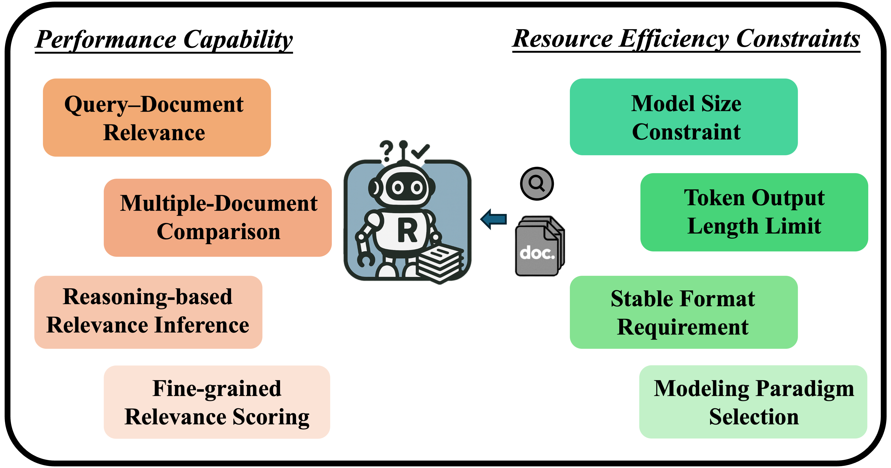
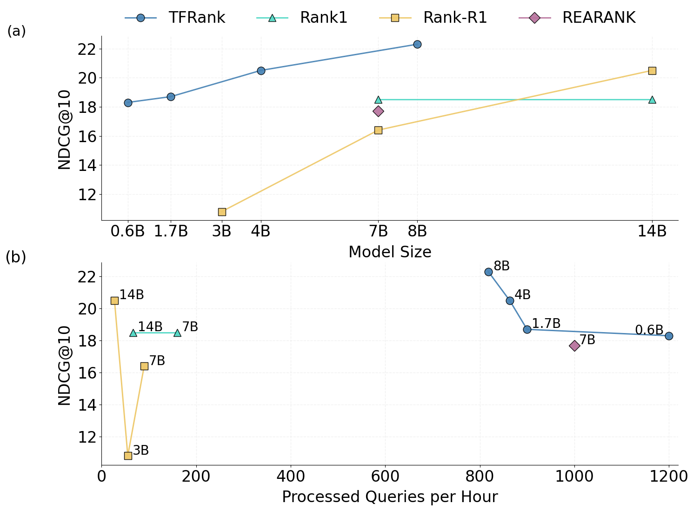

# TFRank: Think-Free Reasoning Enables Practical Pointwise LLM Ranking

## Introduction

Welcome to TFRank. We propose a training framework TFRank for small-scale LLMs that enables efficient and effective pointwise reasoning ranking without explicit reasoning output at inference.

  

  

We have released our training and evaluation code along with partial data samples. The complete training data and models will be made publicly available in the open-source community after the double-blind review process, ensuring compliance with anonymity requirements.