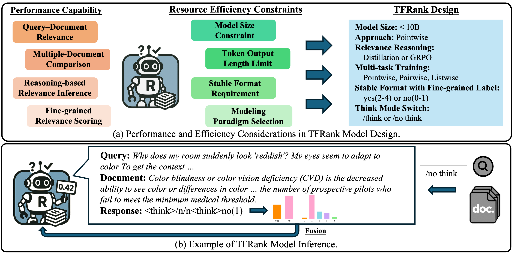
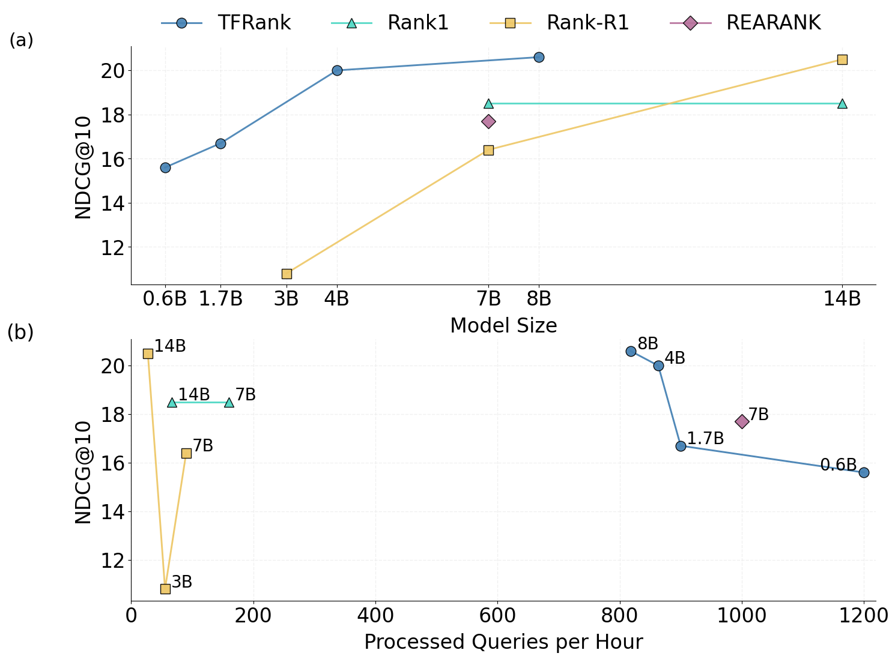

# TFRank: Think-Free Reasoning Enables Practical Pointwise LLM Ranking

## Introduction

Welcome to **TFRank** 🎉
We propose a training framework **TFRank** for small-scale LLMs that enables **efficient and effective pointwise reasoning ranking** *without explicit reasoning output at inference*.

  

---

## Resources

### 📦 Models

*To be released soon...*

### 📂 Datasets

We provide high-quality datasets constructed from multiple sources, integrating **multi-task supervision**, **reasoning chains (CoT)**, and **think-mode-swift** training samples.

| Dataset                                                                                           | Description                                                                                                                                                                                                                                                        |
| :------------------------------------------------------------------------------------------------ | :----------------------------------------------------------------------------------------------------------------------------------------------------------------------------------------------------------------------------------------------------------------- |
| [TFRank-sft-training-data](https://huggingface.co/datasets/Johnnyfans/TFRank-sft-training-data)   | Supervised fine-tuning (SFT) samples aggregated from [Rank1](https://github.com/orionw/rank1), MS MARCO, and DeepSeek-R1. Includes multi-task, CoT, and think-mode-swift samples. |
| [TFRank-grpo-training-data](https://huggingface.co/datasets/Johnnyfans/TFRank-grpo-training-data) | GRPO-based training samples from the same sources.                                                                                                                                                            |

---

## Performance

  

---

## Notes

We have released **training and evaluation code** along with **partial data samples**.
The complete training data and models will be made publicly available in the open-source community **after the double-blind review process**, ensuring full compliance with anonymity requirements.
